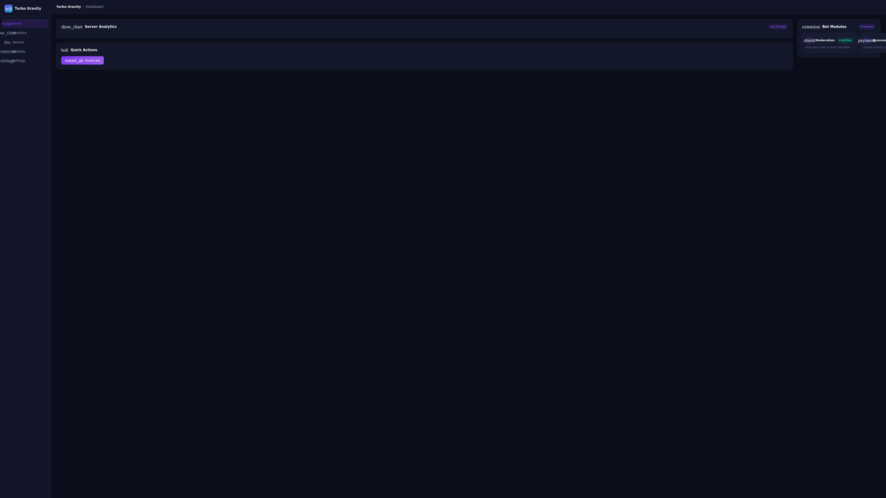
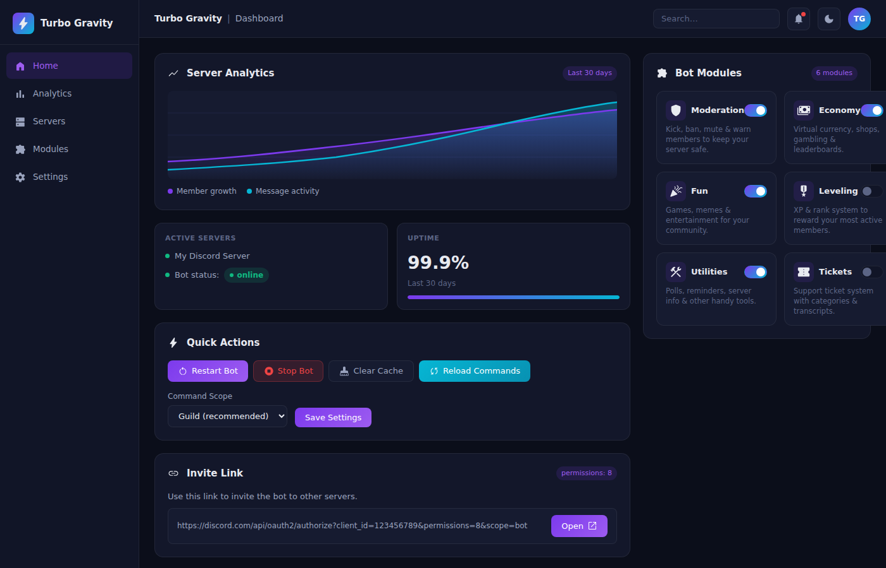
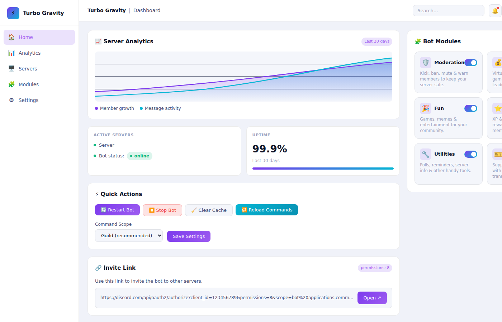
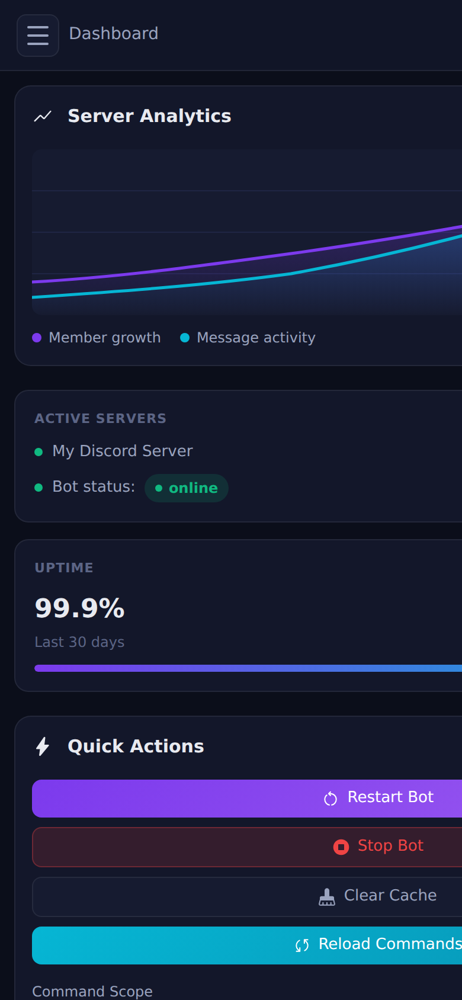
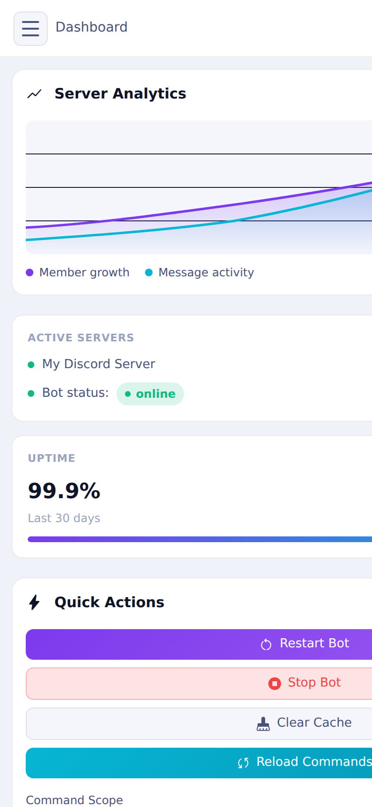
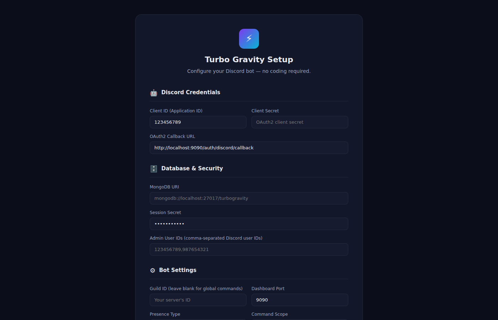

<div align="center">

# 🚀 Turbo Gravity

[](https://github.com/TurboRx/Turbo-Gravity/actions/workflows/ci.yml)
[](LICENSE)
[](https://www.rust-lang.org)
[](https://github.com/serenity-rs/poise)

**A production-ready, feature-rich Discord bot with an optional web dashboard.**  
Built in **Rust** with [Poise](https://github.com/serenity-rs/poise) + [Serenity](https://github.com/serenity-rs/serenity) and [Axum](https://github.com/tokio-rs/axum).

</div>

---

## ✨ Features

- 🎮 **Fun Commands** — Daily rewards, work economy, balance, coin flip, dice roll, 8-ball
- 🗳️ **Misc Commands** — Polls with reaction voting, reminders, random choice picker
- 🔨 **Moderation** — Ban, kick, timeout, warn, warnings log, purge, slowmode, lock/unlock, unban
- 🎫 **Ticket System** — Create, close, add/remove members from support tickets
- 🛠️ **Utility** — Ping, uptime, stats, help, user/server/channel/role info, avatar, embed builder, connection time
- 📊 **Optional Dashboard** — Modern web control panel with sidebar navigation, server analytics, bot module toggles, and a browser-based setup wizard
- 🗄️ **MongoDB Integration** — Persistent economy profiles and warning records (optional — bot runs fine without a DB)
- 📡 **Structured Logging** — `tracing` + `tracing-subscriber` with `RUST_LOG` env-var control
- 🛑 **Graceful Shutdown** — Handles SIGINT/SIGTERM for clean process exit

---

## ⚡ Quick Start

### Prerequisites

- [Rust](https://rustup.rs) — install via rustup
- A Discord bot token from the [Discord Developer Portal](https://discord.com/developers/applications)
- [MongoDB](https://www.mongodb.com/) (optional — bot runs without a database)

### Installation

1. **Clone the repository**
   ```bash
   git clone https://github.com/TurboRx/Turbo-Gravity.git
   cd Turbo-Gravity
   ```

2. **Configure the bot**

   **Option A — Setup Wizard (recommended for non-programmers)**
   Start the bot once, then open `http://localhost:8080/setup` in your browser to configure everything through a guided form.

   **Option B — Edit config directly**
   ```bash
   nano config.toml   # at minimum set bot.token
   ```

3. **Build and run**
   ```bash
   cargo run --release
   ```

The bot registers slash commands to the guild specified by `guild_id` (instant) or globally (up to 1 hour delay) based on `command_scope`.

---

## ⚙️ Configuration (`config.toml`)

```toml
[bot]
token        = ""              # Required: Discord bot token
client_id    = ""              # Discord application/client ID
guild_id     = ""              # Leave empty for global command registration
command_scope = "guild"        # "guild" (instant) or "global"
presence_text = "Ready to serve"
presence_type = 0              # 0=Playing 1=Streaming 2=Listening 3=Watching 4=Competing

[database]
mongo_uri = ""                 # Optional: MongoDB URI; leave empty to run without DB

[dashboard]
enable_dashboard = true        # Set to false to disable the web API entirely
port             = 8080
session_secret   = ""          # Reserved for future OAuth2 session signing
client_secret    = ""          # Reserved for future Discord OAuth2 login
callback_url     = "http://localhost:8080/auth/discord/callback"
admin_ids        = []          # Reserved for future admin access control
```

Environment variables in a `.env` file are loaded automatically (via `dotenvy`) and can be used alongside `config.toml`.

---

## 🏗️ Architecture

```
main.rs
├── Arc<AppState>          ← shared state (config + optional MongoDB pool)
│
├── tokio::spawn → dashboard::serve()   ← optional Axum REST API (port 8080)
│                  State<Arc<AppState>> ← same Arc injected into every route
│
└── bot::start()           ← Poise framework (blocks until shutdown)
       ctx.data()          ← SharedState accessible in every command
```

| Concern | Solution |
|---|---|
| Command framework | `poise 0.6` with `#[poise::command(slash_command)]` |
| Shared state | `Arc<AppState>` — passed as Poise `Data` type and Axum `State` |
| Dashboard toggle | `enable_dashboard = true/false` in `config.toml` |
| Dashboard API | `axum 0.8` spawned via `tokio::spawn` before bot blocks |
| Database | `mongodb 3` driver; bot operates without DB if URI is empty |
| Configuration | `config.toml` (TOML) loaded at startup; `.env` also supported |
| Async runtime | `tokio` with `full` features |
| Graceful shutdown | `tokio::signal` handles SIGINT + SIGTERM |

### Dashboard

The optional web dashboard runs at `http://localhost:8080` (or the configured port).

#### Screenshots (DEMO)

**Dashboard — Dark mode** (default) — 4K Ultra HD (3840×2160)


**Dashboard — Dark mode** (1400×900)


**Dashboard — Light mode** (1400×900)


**Mobile view** (390px — hamburger sidebar, responsive layout)

| Dark | Light |
|------|-------|
|  |  |

**Setup wizard** (`/setup` — browser-based config, no file editing required)


#### Dashboard Routes

| Route | Description |
|---|---|
| `GET /dashboard` | Main control panel — analytics, bot modules, quick actions |
| `GET /setup` | Browser-based setup wizard (pre-fills current config) |
| `POST /setup` | Saves wizard form to `config.toml` and redirects to `/dashboard` |
| `GET /selector` | Guild selector — lists all servers the bot is in |
| `GET /health` | Liveness probe — returns `{"status":"ok","version":"..."}` |
| `GET /api/stats` | Runtime stats (DB connected, bot configured, port) |
| `GET /api/config` | Public (non-secret) config values |
| `GET /styles.css` | Embedded stylesheet (dark/light/system theme support) |

#### Theme Support

The dashboard supports **dark mode**, **light mode**, and **device-default** (respects `prefers-color-scheme`). Use the ☀️ button in the top-right to toggle — your preference is saved to `localStorage`.

---

## 🐳 Docker Deployment

```bash
# Build
docker build -t turbo-gravity .

# Run
docker run -d \
  -p 8080:8080 \
  -v $(pwd)/config.toml:/app/config.toml:ro \
  --name turbo-gravity \
  turbo-gravity
```

Mount your `config.toml` at `/app/config.toml` — **never bake secrets into the image**.

---

## 🧑‍💻 Development

### Adding a new command

1. Create `src/bot/commands/<category>/mycommand.rs`
2. Write the handler following the Poise pattern:
   ```rust
   use crate::bot::{Context, Error};

   /// Brief description shown in /help
   #[poise::command(slash_command, ephemeral)]
   pub async fn mycommand(ctx: Context<'_>) -> Result<(), Error> {
       ctx.say("Hello!").await?;
       Ok(())
   }
   ```
3. Add `mod mycommand;` and include `mycommand::mycommand()` in the `commands()` vec in `src/bot/commands/<category>/mod.rs`

### Accessing shared state

```rust
// ctx.data() returns &Arc<AppState>
let Some(db) = ctx.data().database() else {
    ctx.say("No database configured.").await?;
    return Ok(());
};
```

### Lint / check

```bash
cargo check          # fast type-check
cargo clippy -- -D warnings   # lints (CI-grade)
cargo build --release
```

---

## 🔒 Security Notes

- **Never commit `config.toml`** with real tokens — it is listed in `.gitignore`
- `session_secret` and `client_secret` are reserved for future OAuth2 support
- Use HTTPS in production via a reverse proxy (nginx, Caddy, Traefik)
- MongoDB URI should use credentials in production
- The dashboard API has **no authentication** in the current release — restrict access at the network/proxy level until OAuth2 is implemented

---

## 📄 License

This project is licensed under [MIT](LICENSE).

---

## 🤝 Contributing

We welcome contributions! Please read [CONTRIBUTING.md](CONTRIBUTING.md) for the Rust workflow, commit guidelines, and PR process. For major changes, open an issue first.

---

## 💬 Support

For issues or questions, open an issue on [GitHub](https://github.com/TurboRx/Turbo-Gravity/issues).
